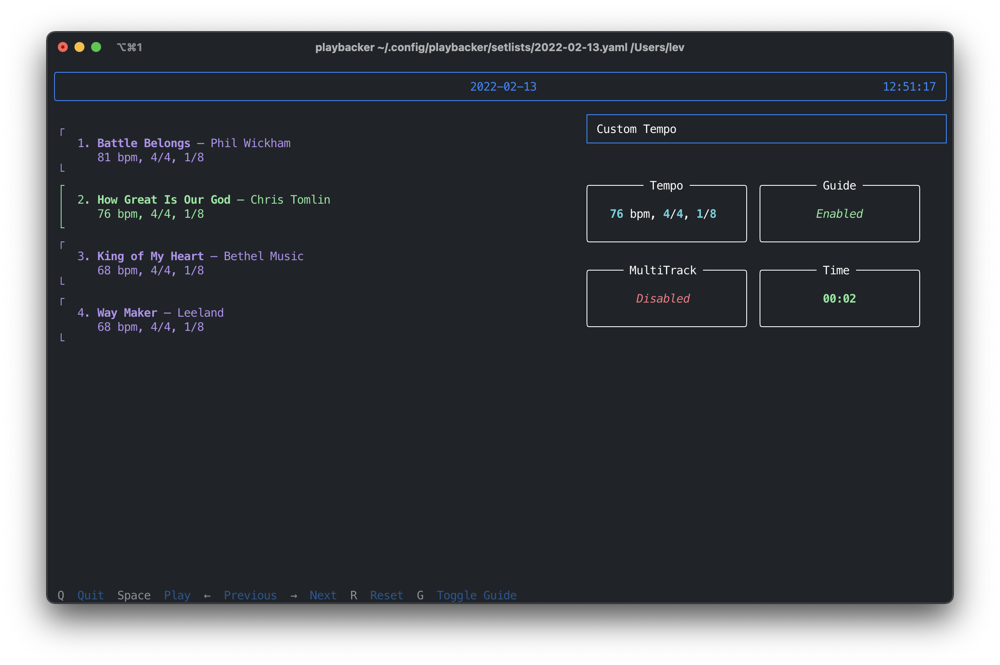

# Playbacker



TUI application for managing playback on live music performances (metronome, cues and backing tracks).

## Rational

Usually people use Ableton Live, Logic Pro or any other DAW for performances. I had issues with this kind of setup: too big, clumsy and require a lot of time.
There's [MultiTracks' Playback](https://www.multitracks.com/products/playback/), but you have to pay a subscription to get important functionality. Also, it doesn't seem that robust.

## Solution

Make my own app! 😃

- Works only on macOS (with minimal effort can be adapted for Linux or Windows)
- Configurable channel map
- Storage management based on simple yaml files
- Fully customizable: can be used as library to make your own frontend, tracks or whatever

## Installation

```sh
pip install git+https://github.com/vrslev/playbacker
```

Or better of with pipx:

```sh
pipx install git+https://github.com/vrslev/playbacker
```

## Usage

- Setup configuration and storage files (example is in /example directory)
- Run `playbacker`

🧸❗️ This is a toy project! There's no release management, PyPI releases, etc for now.
